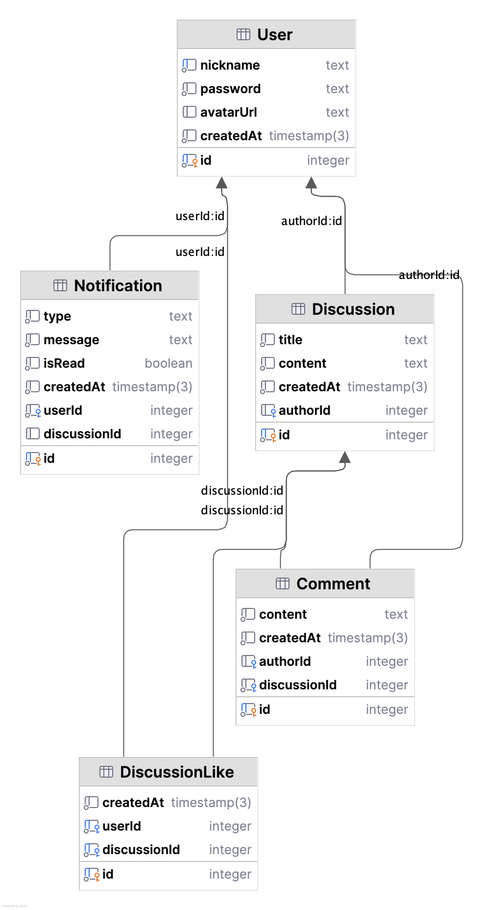

# Mamont Forum

Веб-форум для октрытого общения!

https://botfarm-blog.onrender.com

## Технологии

- **NestJS** — серверный фреймворк
- **Handlebars (.hbs)** — шаблонизатор
- **Prisma 6** — ORM
- **PostgreSQL** — база данных (Render)
- **express-session** — сессии
- **SSE (Server-Sent Events)** — уведомления в реальном времени

## Сущности и отношения

### User (Пользователь)
Аккаунт форума. Имеет никнейм, пароль, опциональный аватар.

### Discussion (Обсуждение)
Основная сущность форума — тема, созданная пользователем.
- **User → Discussion**: один пользователь может создать много обсуждений (`authorId`)
- При удалении пользователя обсуждения сохраняются, автор отображается как «Удалённый пользователь» (`onDelete: SetNull`)

### Comment (Комментарий)
Ответ пользователя внутри обсуждения.
- **Discussion → Comment**: одно обсуждение содержит много комментариев (`discussionId`)
- **User → Comment**: один пользователь может написать много комментариев (`authorId`)
- При удалении обсуждения все его комментарии удаляются (`onDelete: Cascade`)
- При удалении пользователя комментарии сохраняются (`onDelete: SetNull`)

### DiscussionLike (Лайк обсуждения)
Факт того, что пользователь поставил лайк обсуждению.
- **User → DiscussionLike**: один пользователь может поставить много лайков
- **Discussion → DiscussionLike**: у одного обсуждения может быть много лайков
- Уникальная пара `(userId, discussionId)` — нельзя лайкнуть дважды
- При удалении пользователя или обсуждения лайки удаляются (`onDelete: Cascade`)

### Notification (Уведомление)
Системное уведомление для пользователя. Создаётся автоматически при лайке или комментарии.
- **User → Notification**: пользователь получает много уведомлений (`userId`)
- При удалении пользователя его уведомления удаляются (`onDelete: Cascade`)

## ER-диаграмма

